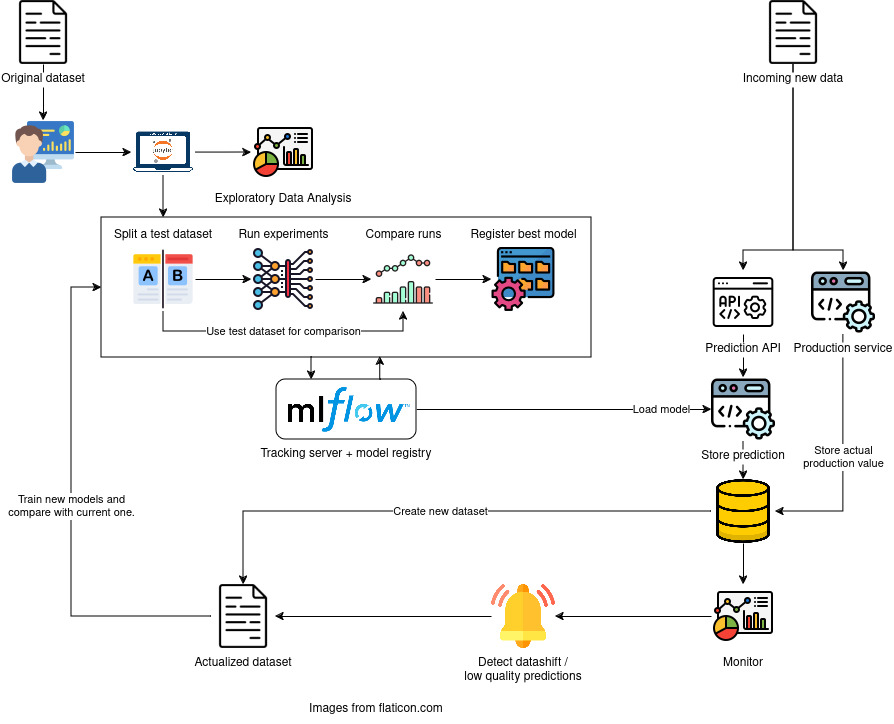

# belo-horizonte-pricing
## Introduction
This project was developped in the context of the [DataTalks.Club MLOps Zoomcamp course](#mlops-zoomcamp-project) and serves as a demonstration project for my knowledge in the implementation of `MLOps methodologies`.

### What is MLOps
According to [Databricks](https://www.databricks.com/glossary/mlops), _"MLOps stands for `Machine Learning Operations` [and focus] on streamlining the process of taking machine learning models to production, and then maintaining and monitoring them"_. In other words, it is a combination of `cultural philosophies`, `good practices` and `tools` inspired from the [DevOps methodologies](https://aws.amazon.com/devops/what-is-devops/) for software and applied to the specif necessities of `Machine Learning` with the intention of increasing an organization’s ability to deliver, then evolve and improve, Machine Learning models at `high velocity` and in a `leaner` way.

### The MLOps process
The process we want to implement in this project is the following:


1. **Experimentation phase:**
    1. Comes a first dataset, analyzed and cleand by a data scientist.
    2. The data scientist runs multiple experiments to find the best possible model, tracking them with MLFlow to be able to reproduce the best ones at anytime using the saved parameters. Each experiment is composed of 4 steps:
        1. Split the dataset in two to keep a test dataset used to decide between the challengers.
        2. Train models on the training set, using the `MLFlow Tracking Server` to store the algorithms,  parameters and results.
        3. Select the best candidates and decide the winner by applying them to the test dataset.
        4. Register the best candidate in the `MLFlow Model Registery` as current champion (model tu use in production).
2. **Deployment in production:**
    1. The model is deployed in production, either via `API` or a `batch process`.
    2. New values are sent for prediction.
    2. The code calls the model register to load the current production model.
    3. Results are returned to the user and stored for monitoring.
3. **Feedback loop:**
    1. On scheduled dates or when a data shift is detected, create a new dataset using recente predictions and actual values.
    2. Execute the model training process automatically using the new dataset (see 1.).
    3. Compare the result of the current model in production with the new champion.
    4. Promote (automatically or not) the new champion if required.

### About this particular project
I decided to use the [**house-pricing-in-belo-horizonte** dataset](https://www.kaggle.com/datasets/guilherme26/house-pricing-in-belo-horizonte) available on Kaggle to try to solve the classic `house pricing prediction` problem. I chose this dataset because I'm a frenchie living in Brasil and thought it was fun. The dataset is, howver, _rather small_ and somewhat _limitated in the quantity of features_ as demonstrated by the [Explory Data Analysis](EDA.ipynb). This implies that our capacity to predict precisely the prices will be limited. It is nevertheless not really a problem since the main focus of this project is on the MLOps methodologies and not on pure Machine Learning technics.

Applying the previously described process, our project is to do the following:
1. **Experimentation phase:**
    1. Get a 2021 dataset from Kaggle (scrapped data).
    2. Run an exploratory data analysis in a Jupyter Notebook.
    3. Run experiments in a Jupyter Notebook to select the first production model.
2. **Deployment in production:**
    1. Deploy the model in AWS Lambda.
    2. Create a REST API (AWS API Gateway) to call the model and predict the estate value.
3. **Feedback loop:**
    1. Since we don't have real API calls and since I didn't have time to scrap a real dataset, I decided to create synthetic data, applying a random increase in price between 10 and 20% to the original dataset to simulate the data shift due to the estate inflation since 2021.
    2. [I didn't have time for this yet] The data shift is detecting automatically though the monitoring.
    3. We train the same models than in the notebook, this time in Airflow to automate the process. I decided to use Airflow instead of Mage because I didn't really like this platform and wanted to experiment with Airflow.
    3. For this experiment, I decided to promote the new best model manually in the MLFlow Model Registry.

## Install the project
The following tools are used to run the project locally, please follow the links for installation instructions:
1. This project uses [Poetry](https://python-poetry.org/docs/) to manage it's dependency. Then, from the project folder root, run:
```
poetry install --with dev,test
```
2. We use [Docker](https://docs.docker.com/engine/install/) to run our code locally in containers and upload images. To run our process, services like our `MLFlow Tracker Server`, a `MySQL` database and [MinIO](https://min.io/) (an AWS S3 manager) ran using `docker compose`. To start them, from the project folder root, run:
```
docker compose up
```
3. Finally, we use [AWS SAM](https://docs.aws.amazon.com/serverless-application-model/latest/developerguide/install-sam-cli.html) to simulate the AWS services locally (AWS Lambda, API Gateway).

## Tutorial
If you want to have a quick look at the project or even run it on your machine, you can follow this [tutorial](/tutorial.md).

## MLOps Zoomcamp Project
This project was developped for the [DataTalks.Club MLOps Zoomcamp course](https://github.com/DataTalksClub/mlops-zoomcamp).

### Self-Evaluation
**Problem description:**
- [ ] 0 points: The problem is not described
- [ ] 1 point: The problem is described but shortly or not clearly
- [x] 2 points: The problem is well described and it's clear what the problem the project solves

Hopefully, the README will be clear enough.

**Cloud:**
- [ ] 0 points: Cloud is not used, things run only locally
- [X] 2 points: The project is developed on the cloud OR uses localstack (or similar tool) OR the project is deployed to Kubernetes or similar container management platforms
- [ ] 4 points: The project is developed on the cloud and IaC tools are used for provisioning the infrastructure

I used `docker compose` to run the project locally since I didn't want to pay for servers and databases. However, I did use `AWS SAM framework` to create an [IaC template](template.yaml) and manage an `AWS CloudFormation stack`. Unfortunately, I hit a problem due to the fact that the MLFlow lib is too big for a classic `zipped` lambda and I didn't get the time to complety understand how to deploy the `image` version of the service.

**Experiment tracking and model registry:**
- [ ] 0 points: No experiment tracking or model registry
- [ ] 2 points: Experiments are tracked or models are registered in the registry
- [x] 4 points: Both experiment tracking and model registry are used

**Workflow orchestration:**
- [ ] 0 points: No workflow orchestration
- [x] 2 points: Basic workflow orchestration
- [ ] 4 points: Fully deployed workflow
Not sure what is a *fully deployed workflow* means but I guess I at leasst qualify for the basic workflow.

**Model deployment:**
- [ ] 0 points: Model is not deployed
- [ ] 2 points: Model is deployed but only locally
- [x] 4 points: The model deployment code is containerized and could be deployed to cloud or special tools for model deployment are used

Everything runs in docker except for the notebooks since they are supposed to run locally :)

**Model monitoring:**
- [x] 0 points: No model monitoring
- [ ] 2 points: Basic model monitoring that calculates and reports metrics
- [ ] 4 points: Comprehensive model monitoring that sends alerts or runs a conditional workflow (e.g. retraining, generating debugging dashboard, switching to a different model) if the defined metrics threshold is violated

I didn't have time to play with monitoring but I do hope to implement this feature in the future.

**Reproducibility:**
- [ ] 0 points: No instructions on how to run the code at all, the data is missing
- [ ] 2 points: Some instructions are there, but they are not complete OR instructions are clear and complete, the code works, but the data is missing
- [x] 4 points: Instructions are clear, it's easy to run the code, and it works. The versions for all the dependencies are specified.

I did my best to explain clearly how to play with my project and I used `poetry` (similar to `pipenv`) to manage my dependencies.

**Best practices:**
- [x] There are unit tests (1 point):
    - The coverage is far from complete but you can run `poetry run pytest` to execute some unit tests.
- [ ] There is an integration test (1 point)
- [x] Linter and/or code formatter are used (1 point)
    - Execute `poetry run blue .` to use the [blue code formatter](https://pypi.org/project/blue/).
    - Execute `poetry run isort .` to use the `isort`.
    - Execute `poetry run pylint /src` to use the linter (my code has been rated at 7.50/10, there is still work to do).
- [ ] There's a Makefile (1 point)
- [X] There are pre-commit hooks (1 point):
    - Run `poetry run pre-commit install` to initialize the pre-commit hook after installing the project.
- [ ] There's a CI/CD pipeline (2 points)
