# Tutorial
## 0. Initialize the project
1. First, let's build our docker image for further use:
```
docker build -t mlops/mlops:0.1.0 src/
```
2. Start the service (mlflow, airflow, min.io and postgres) by running docker compose. For the first execution, I recommand running the initialization of airflow first:
```
docker compose up airflow-init
```
You can then run the classic:
```
docker compose up
```
 The first time, the services need to be initialized and it might take some time. You'll know that everything is ready when you'll see that the `airflow-webserver-1` workers are ready:
```
airflow-webserver-1    | [2024-08-19 00:59:36 +0000] [42] [INFO] Listening at: http://0.0.0.0:8080 (42)
airflow-webserver-1    | [2024-08-19 00:59:36 +0000] [42] [INFO] Using worker: sync
airflow-webserver-1    | [2024-08-19 00:59:36 +0000] [75] [INFO] Booting worker with pid: 75
airflow-webserver-1    | [2024-08-19 00:59:36 +0000] [76] [INFO] Booting worker with pid: 76
airflow-webserver-1    | [2024-08-19 00:59:36 +0000] [77] [INFO] Booting worker with pid: 77
airflow-webserver-1    | [2024-08-19 00:59:36 +0000] [78] [INFO] Booting worker with pid: 78
```
3. Access the minio interface at http://127.0.0.1:9001. Connect using the AWS credentials given in the `.env` file:
```
AWS_ACCESS_KEY_ID=XeAMQQjZY2pTcXWfxh4H
AWS_SECRET_ACCESS_KEY=wyJ30G38aC2UcyaFjVj2dmXs1bITYkJBcx0FtljZ
```
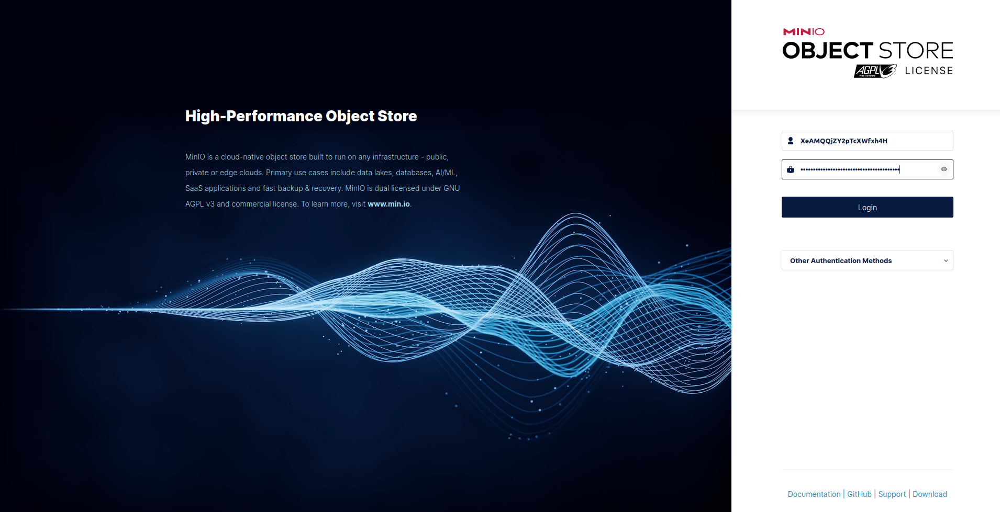

4. In the Browser page, two buckets should have been created by default:
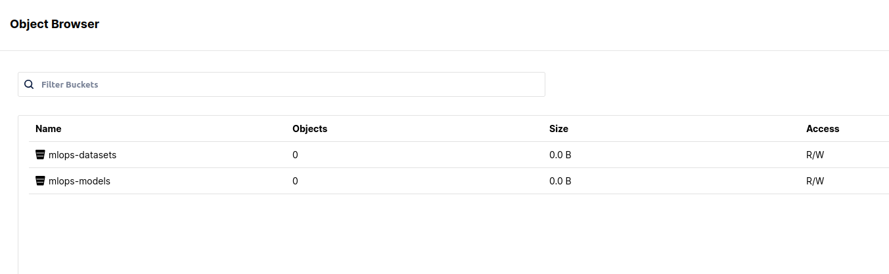

Click on [mlops-dataset](http://127.0.0.1:9001/browser/mlops-datasets) and upload the files from the `/data` folder of the project:
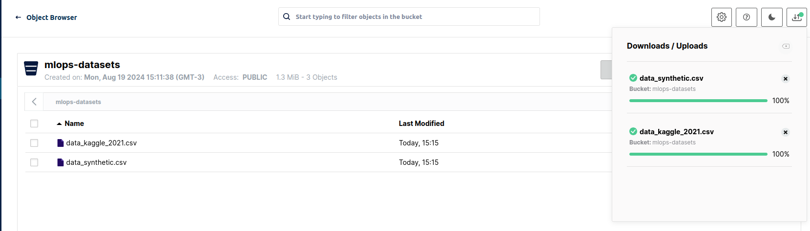

## 1. Run local experiments
In our scenario, data scientists will first run multiple experiments locally in Jupyter Notebooks, using MLFlow to track the experiments and select the best model (the champion) to register it in the MLFlow Model Registry:
1. In a new terminal, start jupyter:
```
poetry run jupyter notebook
```
2. The folder `notebooks/` contains 2 notebooks:
- EDA.ipynb is the Exploratory Data Analysis noteebook where I created to select and prepare the best variables. Keep in mind I'm no Data Scientst please.
- Run experiments.ipynb is a very simple simple experiment training a simple `Linear Regression` and registering it as the **champion** in the `MLFlow Model Registy`.
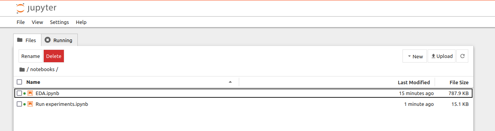

3. You can check/run the EDA notebook if you're curious.
4. **Run** the "Run experiments" notebook to create the experiment and **register our first model**.
5. You can close Jupyter and the terminal window.
6. Open [MLFlow](http://localhost:5000). As you can see, our experiment using a `simple linear regression` was registered, as well as our model with the `Champion` alias.
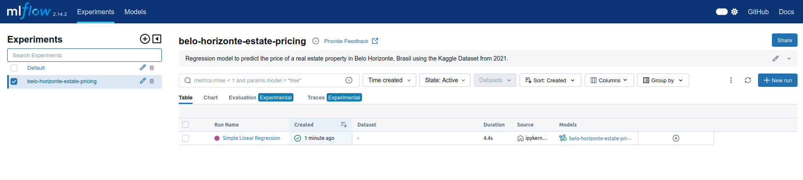
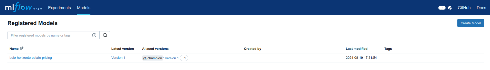

## 2. Using an API to call the model
Now that a model has been registered, we can use our API to call it and realize predictions. I decided to use AWS Lambda and AWS API Gateway to create a serverless API. I also used the framework SAM (Serverless Application Model) to facilitate the creation of IaC templates and allow you to test the API locally.

1. First, you need to install AWS SAM CLI if you didn't do it yet (see the README).
2. You then use sam to build the project, which will build a docker image and create a Cloud Formation template ready for deployment.
```
sam build
```
3. You can test the lambda locally sending an event I created to simulate a REST API call:
```
sam local invoke -e events/prediction.json ServeModelFunction --docker-network belo-horizonte-pricing_frontend
```
4. You call also test the whole API + Lambda locally to test calling the API directly:
```
sam local start-api --docker-network belo-horizonte-pricing_frontend
```
With the local api running, you can call it, I used Postman but you could used cURL or Python, to get a dynamic result:
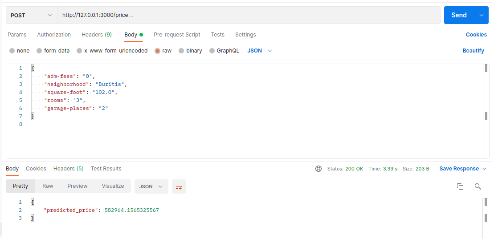

5. Using `cURL`:
```
curl --location --request POST 'http://127.0.0.1:3000/price' \
--header 'Content-Type: application/json' \
--data-raw '{"adm-fees": "0", "neighborhood": "Buritis", "square-foot": "102.0", "rooms": "3", "garage-places": "2"}'
```

## 3. Automate the experiment
1. Access the airflow webserver at http://127.0.0.1:8080 and connect with login `airflow` and password `airflow`.
2. There should be only one DAG (automated process) called `auto_training_regression`. Start it by clicking on the `Pause/Unpause DAG` button on the left of the DAG name:
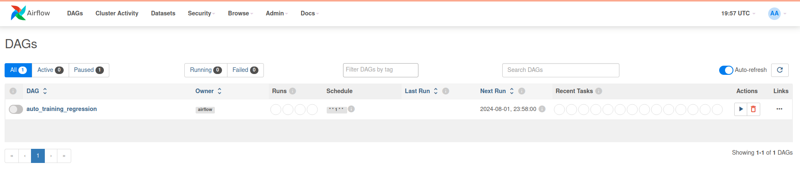

Click on the name of the DAG to enter the execution details. On the left of the screen, you can see the the tasks running. On my machine, it took about 4 minutes.

3. If you click on the `Graph` tab, you can visualize the DAG as a Graph. As you can see, I added a new ElasticNet model to the experiment. The idea is to run multiple models in parralel to check which algorithm is better. However, due to the limitations of running on a local machine and to respect your time, I decided to keep it simple.
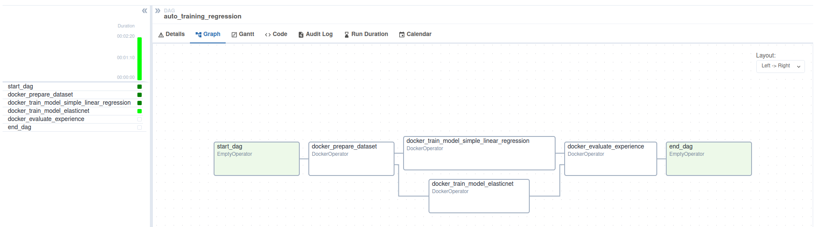

3. Once all the tasks of the DAG have ran (all checkboxes turned to dark green), you can check the [MLFlow Models page](http://localhost:5000/#/models) to see that the process elected a new challenger for our model. The champion, however stayed the same. However, you can easily change by adding the flag `--auto-promote` to the command of the `t4` task of the [DAG description](dags/auto_training.py) (l. 102).
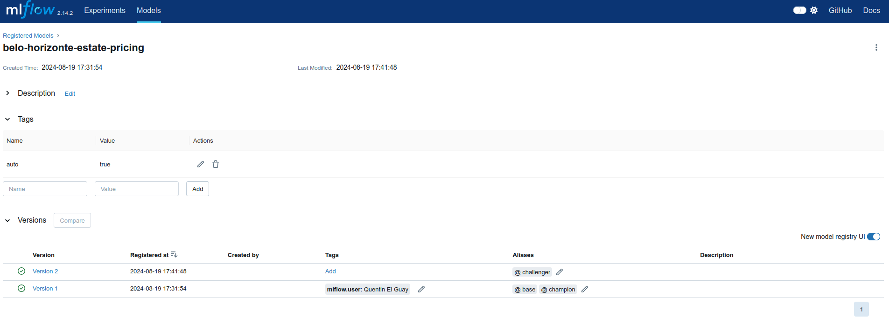

4. If you are interested, you can simulate the need for a new experiment by clicking on the **Trigger DAG** (:arrow_forward:) on the top right corner of the screen. This should open a page asking you for the `experience_name` and the `dataset_uri`. Change the dataset URI to s3://mlops-datasets/data_synthetic.csv. This dataset simulate an inflation of the prices of the properties of ~10%, which would require retraining the model. Click on **Trigger** to start the process.

5. You can now go back to MLFlow and promote manually your new challenger:
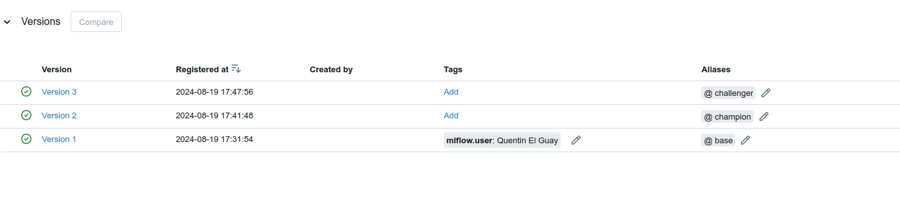

6. Using our API again, and without changing anything else, I can ask for a new prediction and get a new value (not by much though):
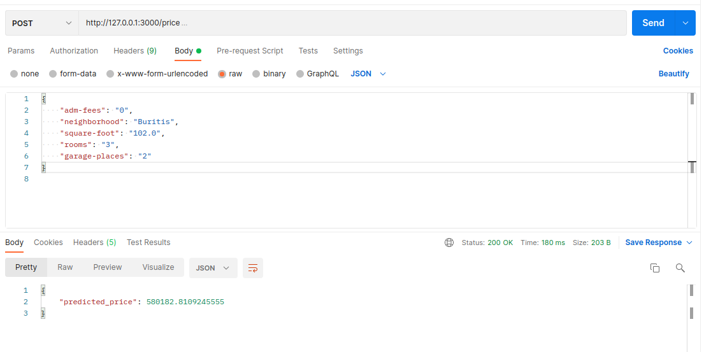
